# Local Mate

👋 Gelen turistlerin, ziyaret ettikleri şehirde yerel halkla doğrudan iletişim kurarak özel rehberlik hizmeti almasını sağlayan bir mobil uygulama.

---

## 🔑 Giriş & Kayıt

  
  

---

## 🏠 Ana Sayfa & Mekan Detayları

  
  
  
  
  
  
  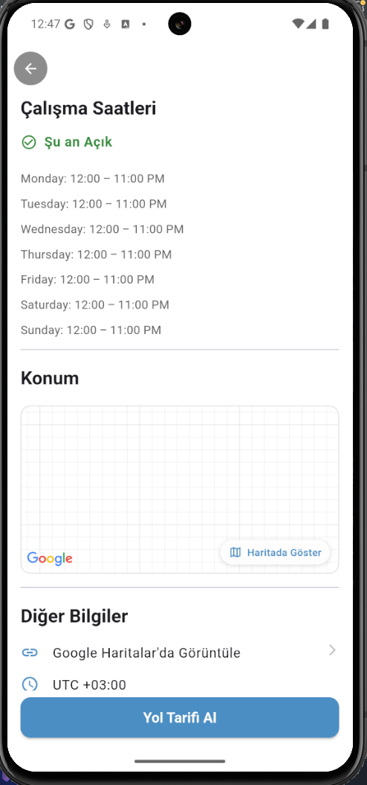
  

---

## 🗺️ Rehber Özellikleri

  
  
  
  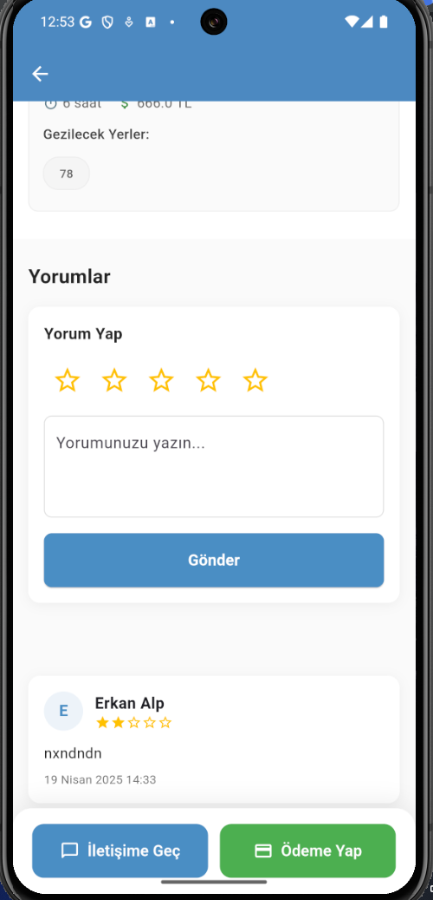
  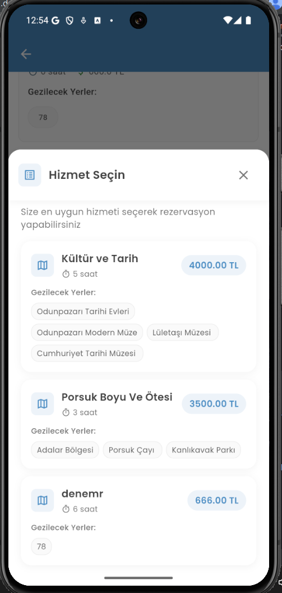
  
  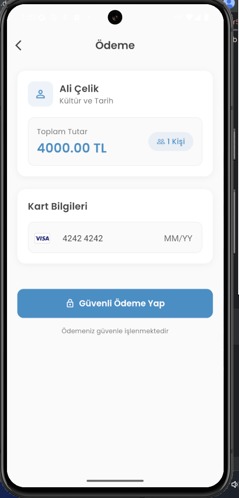

---

## 💬 Mesajlaşma

  
  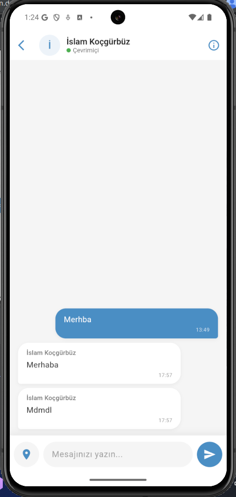

---

## 👤 Kullanıcı Profili

  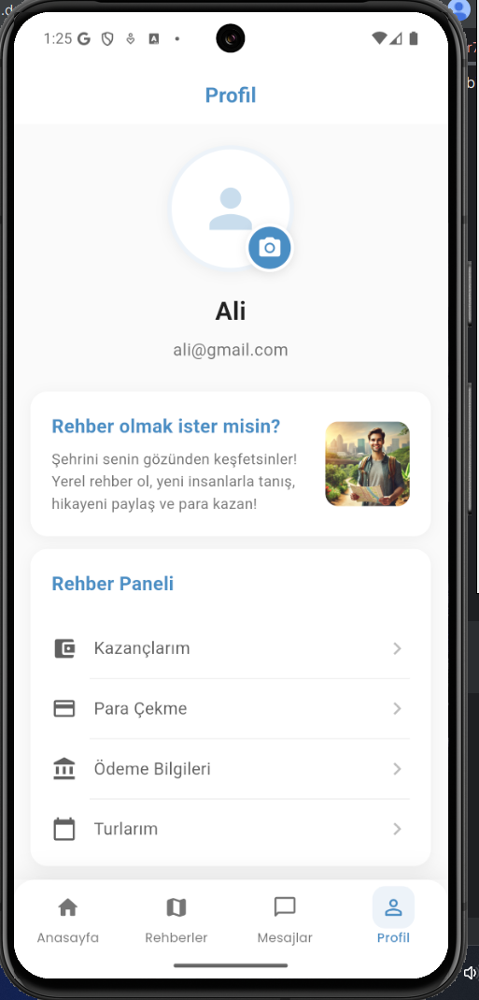
  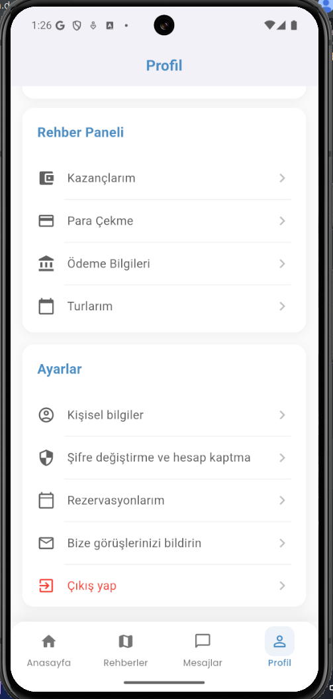
  
  
  
  
  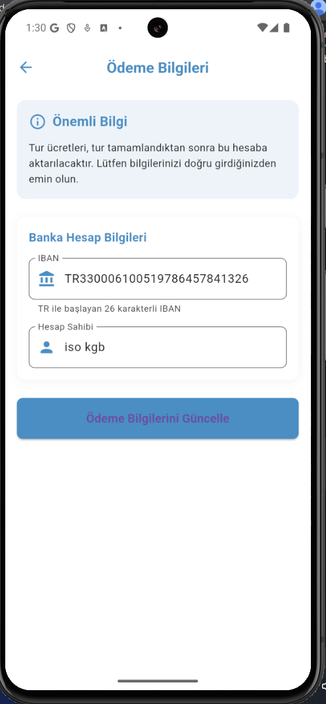
  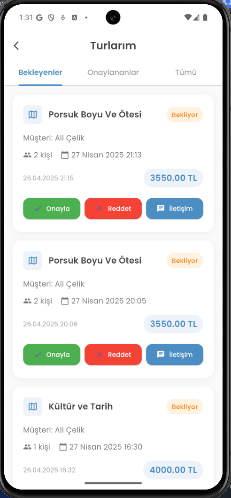
  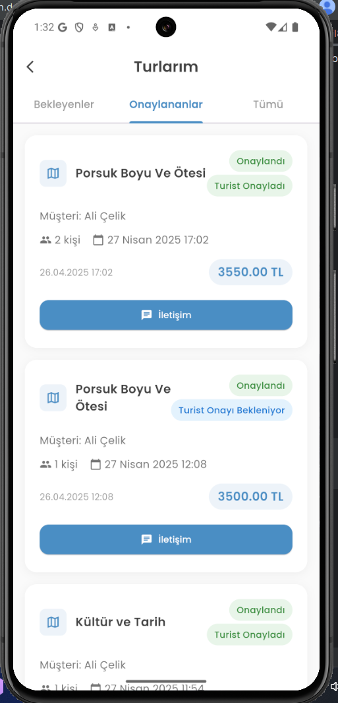
  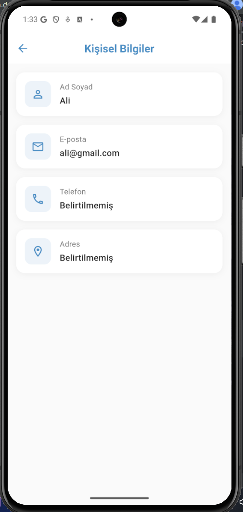
  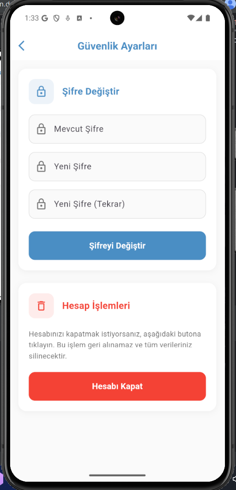
  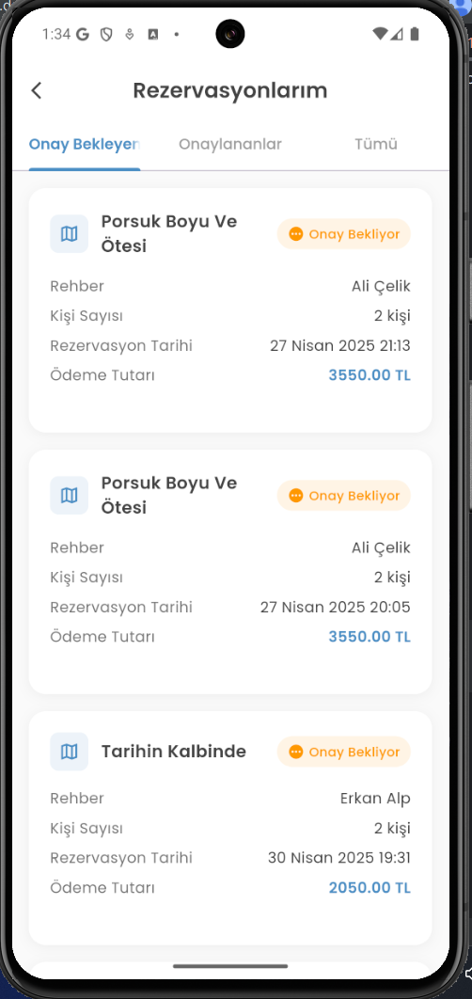
  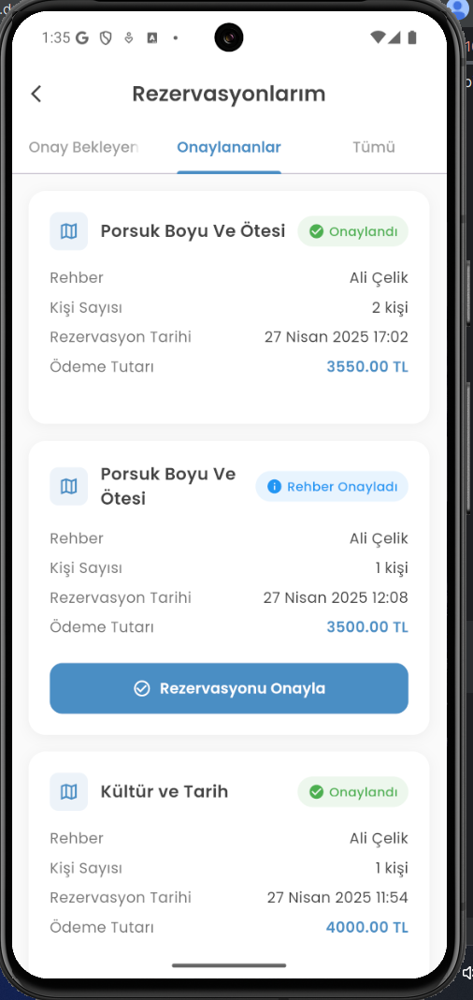
  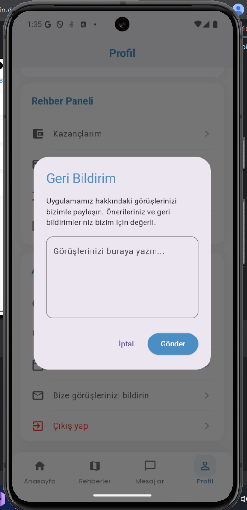

---

## ✨ Rehber Kayıt Süreci

  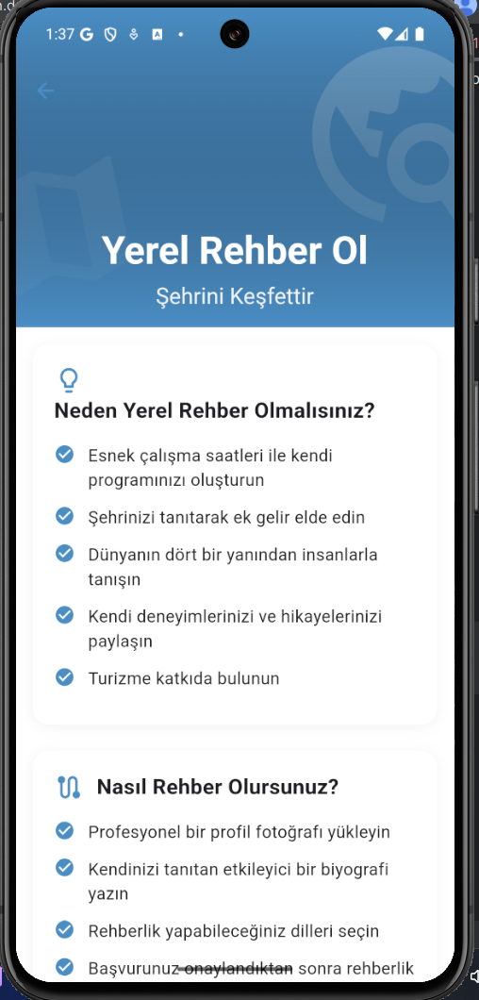
   
  
  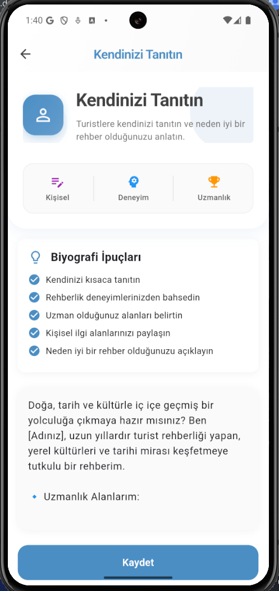
  
  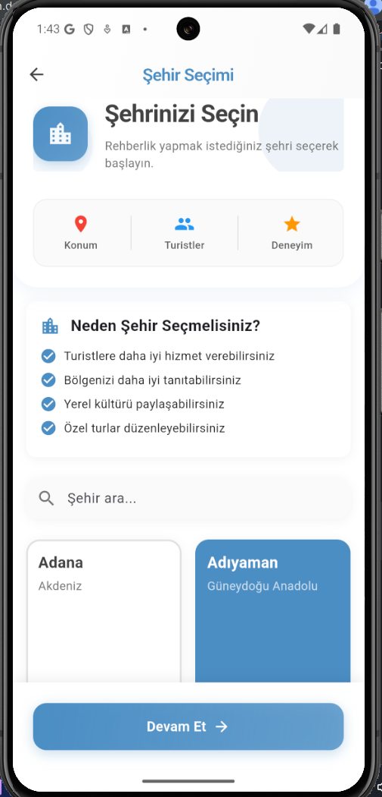
  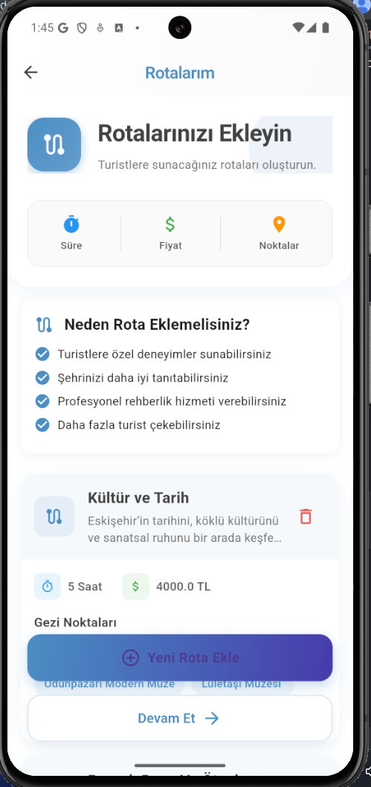
  
  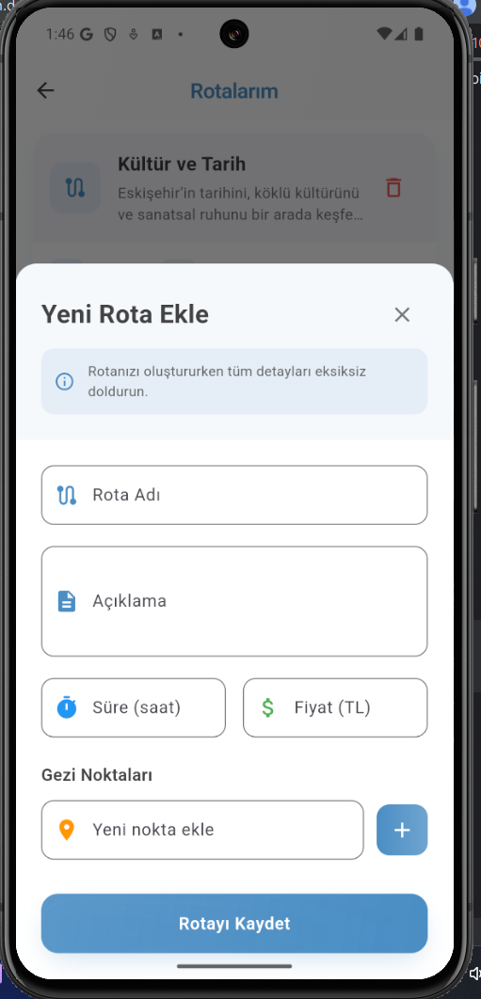
  
  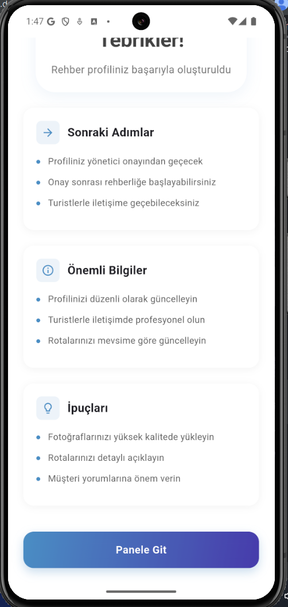

